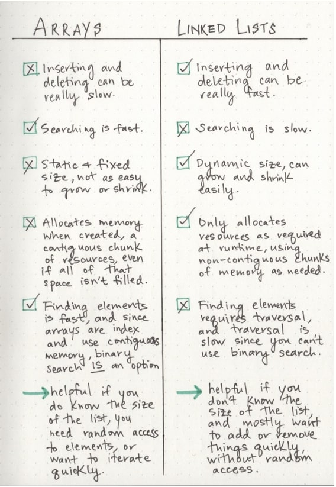

# Linked Lists
***There are two types of Linked List - Singly and Doubly.***

1. ***Linked List - A data structure that contains nodes that links/points to the next node in the list.***
2. ***Singly - Singly refers to the number of references the node has. A Singly linked list means that there is only one reference, and the reference points to the Next node in a linked list.***
3. ***Doubly - Doubly refers to there being two (double) references within the node. A Doubly linked list means that there is a reference to both the Next and Previous node.***
4. ***Node - Nodes are the individual items/links that live in a linked list. Each node contains the data for each link.***
5. ***Next - Each node contains a property called Next. This property contains the reference to the next node.***
6. ***Head - The Head is a reference of type Node to the first node in a linked list.***
7. ***Current - The Current is a reference of type Node to the node that is currently being looked at. When traversing, you create a new Current variable at the Head to guarantee you are starting from the beginning of the linked list.***

# Linear data structures
***We can think of a linear data structure like a game of hopscotch: in order to get to the end of the list, we have to go through all of the items in the list in order, or sequentially. Linear structures, however, are the opposite of non-linear structures. In non-linear data structures, items don’t have to be arranged in order, which means that we could traverse the data structure non-sequentially.***

## Memory management

- ***When an array is created, it needs a certain amount of memory. If we had 7 letters that we needed to store in an array, we would need 7 bytes of memory to represent that array. But, we’d need all of that memory in one contiguous block. That is to say, our computer would need to locate 7 bytes of memory that was free, one byte next to the another, all together, in one place.***

- ***when a linked list is born, it doesn’t need 7 bytes of memory all in one place. One byte could live somewhere, while the next byte could be stored in another place in memory altogether! Linked lists don’t need to take up a single block of memory; instead, the memory that they use can be scattered throughout.***

## Lists for all shapes and sizes

- ***Singly linked lists are the simplest type of linked list, based solely on the fact that they only go in one direction. There is a single track that we can traverse the list in; we start at the head node, and traverse from the root until the last node, which will end at an empty null value***

- ***But just as a node can reference its subsequent neighbor node, it can also have a reference pointer to its preceding node, too! This is what we call a doubly linked list, because there are two references contained within each node: a reference to the next node, as well as the previous node. This can be helpful if we wanted to be able to traverse our data structure not just in a single track or direction, but also backwards, too.***

## Growing a linked list
***the simplest place we can insert an element into a linked list: at the very beginning. This is fairly easy to do, since we don’t need to go through our entire list; instead we just start at the beginning.***

1. ***First, we find the head node of the linked list.***
2. ***Next, we’ll make our new node, and set its pointer to the current first node of the list.***
3. ***Lastly, we rearrange our head node’s pointer to point at our new node.***

## To list or not to list? 

