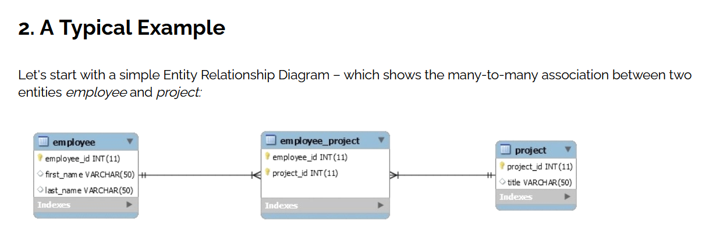

# Hibernate Many to Many 
***Create mappings using Hibernate's many-to-many annotations, which is a more convenient counterpart compared to creating XML mapping files. That is a relationship between two classes to share some information together.***

# This World of Ours
## James Mickens 
***The Author talked about the security through authentication. Such as, using a strong password for your e-mail, and never share it with others to avoid hacking.***