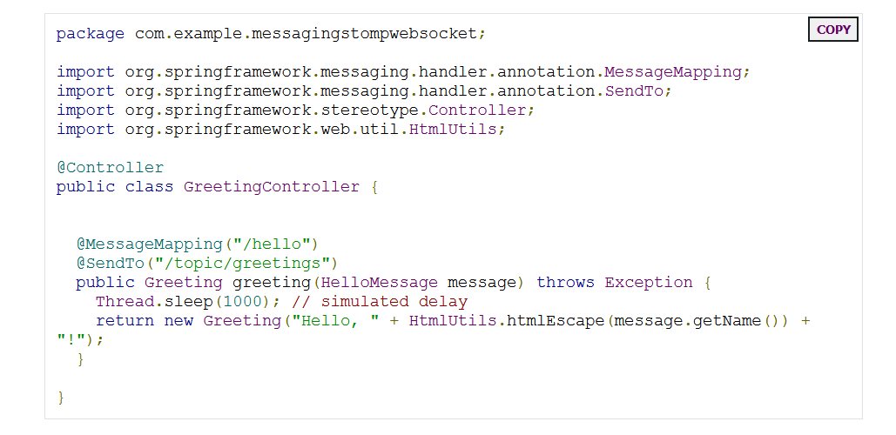
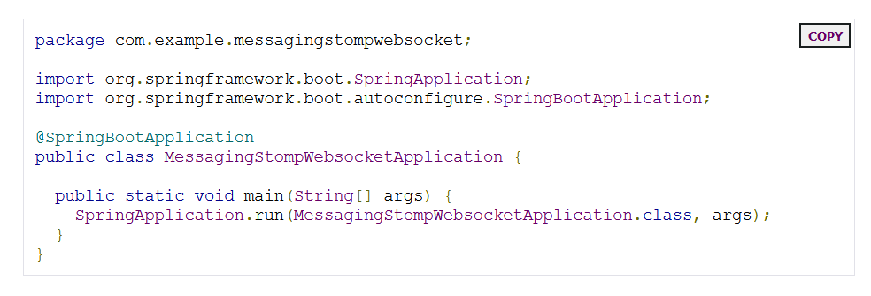

# Spring and Sockets

## Manual Initialization (optional)

***If you want to initialize the project manually rather than use the links shown earlier, follow the steps given below:***

1. ***Navigate to `https://start.spring.io.` This service pulls in all the dependencies you need for an application and does most of the setup for you.***
2. ***Choose either Gradle or Maven and the language you want to use. This guide assumes that you chose Java.***
3. ***Click Dependencies and select Websocket.***
4. ***Click Generate.***
5.*** Download the resulting ZIP file, which is an archive of a web application that is configured with your choices.***

## Create a Message-handling Controller

***In Spring’s approach to working with STOMP messaging, STOMP messages can be routed to `@Controller` classes. For example, the `GreetingController` (from `src/main/java/com/example/messagingstompwebsocket/GreetingController.java`) is mapped to handle messages to the `/hello` destination, as the following listing shows:***

***This controller is concise and simple, but plenty is going on. We break it down step by step.***

***The `@MessageMapping` annotation ensures that, if a message is sent to the `/hello` destination, the `greeting()` method is called.***
***The payload of the message is bound to a HelloMessage object, which is passed into `greeting()`.***

## Make the Application Executable
***Spring Boot creates an application class for you. In this case, it needs no further modification. You can use it to run this application. The following listing (from `src/main/java/com/example/messagingstompwebsocket/MessagingStompWebsocketApplication.java`) shows the application class:***

***`@SpringBootApplication` is a convenience annotation that adds all of the following:***

- **`@Configuration`: Tags the class as a source of bean definitions for the application context.**

- **`@EnableAutoConfiguration`: Tells Spring Boot to start adding beans based on classpath settings, other beans, and various property settings. For example, if spring-webmvc is on the classpath, this annotation flags the application as a web application and activates key behaviors, such as setting up a DispatcherServlet.**

-**` @ComponentScan`: Tells Spring to look for other components, configurations, and services in the com/example package, letting it find the controllers.**

> ***The` main()` method uses Spring Boot’s `SpringApplication.run()` method to launch an application. Did you notice that there was not a single line of XML? There is no `web.xml` file, either. This web application is 100% pure Java and you did not have to deal with configuring any plumbing or infrastructure.***
